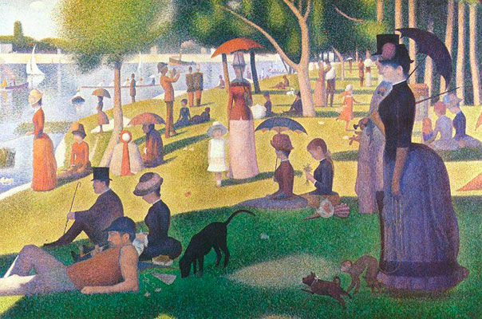
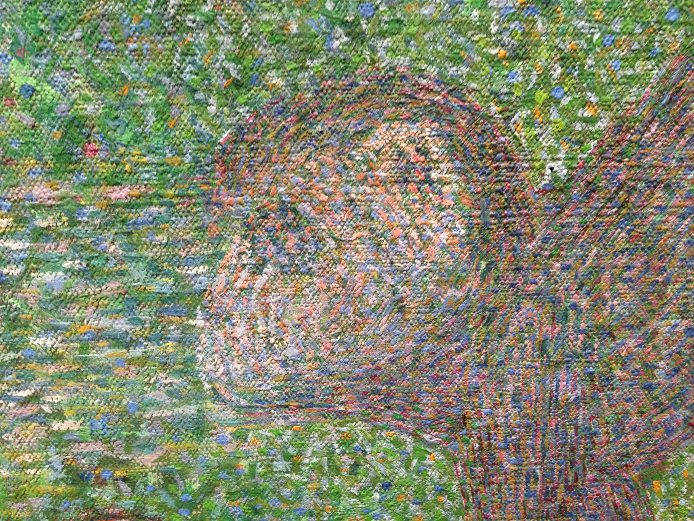
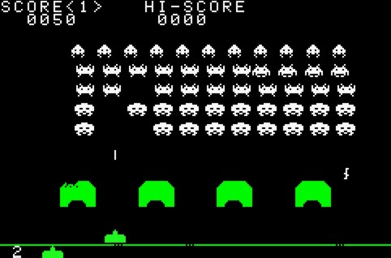
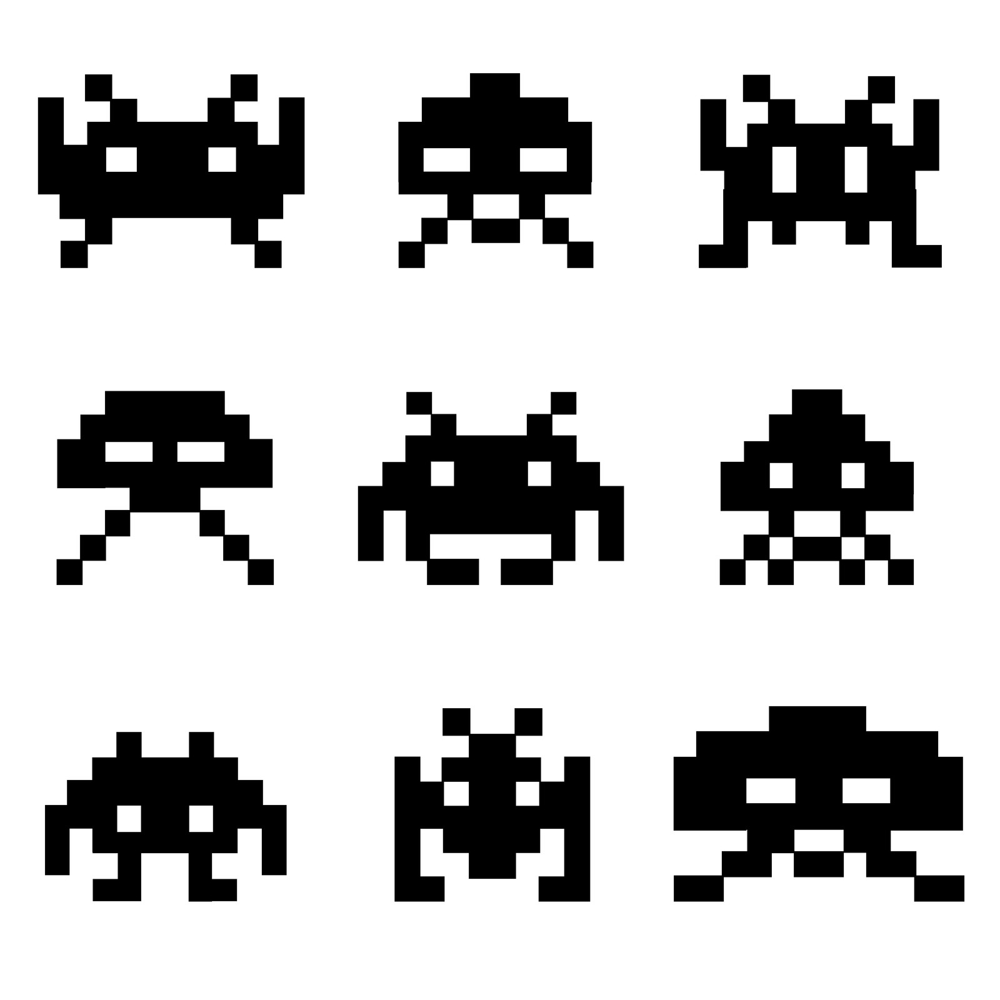
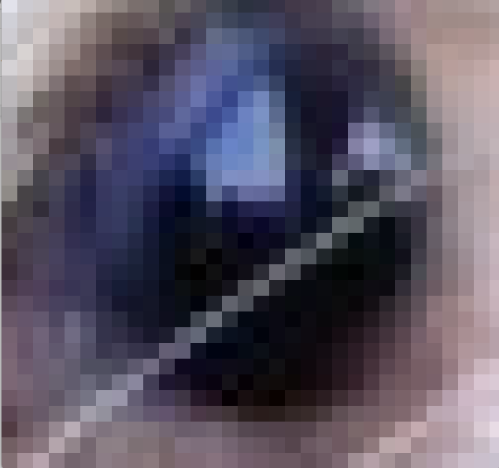

# All the Stickerz
## Description
In this combo offline/online activity, learners explore how some digital images are made of pixels, and how those images are structured and displayed. They discuss what they’d most like to communicate online, and create their own, novel visual communication tool to do it: a pixel art image or web sticker. They create web stickers in analog form first, and then recreated them with digital tools. Learners add their stickers to their own sites (if they’ve created sites in WRITE activities), or try sending them via email or posting them on social media. 

## Learning Objectives
* Define the term ‘pixel.’ 
* Explain how bitmaps determine screen resolution.
* Create pixel images online and offline.

## Time Required
45 minutes to 1 hour depending on group size

## Audience
Can be tailored for audiences from 13 up; with varying levels of experience with the web.

## Materials
* Laptop with internet connection
* Print out pictures within this activity or pull up on computer/project setup
* Whiteboard, flipchart, or paper
* multi-color sticky notes
* Pencil or pen
* Narrow tape or string (with tape)

## Web Literacy Skills
* Design
* Remix
* Share
* Connect
* Evaluate
* Revise

## 21st Century Skills
* Communication
* Collaboration
* Creativity

## Earning Digital Badges
Digital badges collect evidence and are the demonstration of learned web literacy skills. Digitalme is offering web literacy badges through the Open Badges Academy. 

## Introduction 
[1 min]
* Explain: We’re going to talk about how computers create and store images using lots of tiny bits of color, and how we use those images to communicate online. And we’re going to create some very simple images of our own, both in analog and digital form. 

## Discussion: Pixels 
[5-10 mins]
* Ask Learners: Who has heard the term “pixel” before? What’s a pixel? What do you know about them? Tip! May have to explain the difference between pixel the computing term, and Pixel the Google smartphone product. 
* Explain: The term “pixel” comes from the word Picture Element. It’s the smallest possible element, the smallest unit of information in a digital image. 
* These appear on your computer screen as white or colored dots of light, or as dots that aren’t lit and appear black. 
* Creating images with lots of tiny elements is not a new idea! Let’s look at and talk about some examples. 
* Ask learners: what are similarities and differences in the following images? What’s the smallest element that makes up each image? *(could mention artist George Seurat’s blending of colors and layering of brush strokes, Chuck Close uses brush strokes but within a grid of sorts; the video game Space Invaders has no blending and layering, and you can see a strong grid)* 

## Discussion: Screens, Bitmaps, and Resolution
[5-10 mins]
* Ask learners: When artists like Chuck Close and George Seurat create an image, what are they working on? What is the surface they work on? (Answers might be: paper, canvas, wood, walls for muralists etc.) 
* Point out that in the real world these items always have measurable dimensions - whether they are teeny tiny or as big as the side of a building.
* When we look at digital images: what’s the surface? what’s the digital equivalent of a canvas or sheet of paper? (Answers: the screens of our computer monitors or phones or laptops or TVs.)
* Point out that like paper or canvas, screens also have physical dimensions (i.e. the height and width of your smartphone or computer screen). 
* Also, screens have digital constraints. Each screen has a maximum number of pixels available to display images. This is called the screen resolution.  It’s expressed in two dimensions, width and height in pixels. Examples: 
    * 1280 x 800 
    * 1024 x 640 
* Note that there’s no fixed official measurement for a pixel.  It depends on the physical dimensions of the screen and the screen resolution. 
* A giant billboard in Times Square might have a pixel size of 12 inches by 12 inches, and your smartwatch will have a microscopic pixel size. 
* Explain to learners that when we use computers to create or display an image made from lots of pixels, the computer uses a grid -  a matrix of pixels, called a bitmap, to organize the visual information. 
* Each “bit” of information in the image, each pixel, has its own unique location on the grid or “map”.
* This is true of digital photographs as well as digital artworks or images - like logos or illustrations - created from scratch.
* Here’s an example, a image of a hedgehog, and a close up of the pixels that makes up the eye:

* Like a display screen, an image also has resolution-- the total number of pixels in the entire image. 
* We calculate the resolution of an image by multiplying the width and the height of the bitmap
* Ask learners: who has heard the term “low resolution”? Or “high resolution?” What do these mean? (answers: low resolution means an image with fewer pixels, high resolution means an image with more pixels. The more pixels there are in the image, the more information and detail we get. ) 

## Offline Activity: Analog Pixel Art 
[15-20 mins]
* Explain to learners that they’ll create some art using pixels, but in an analog way. They’ll create an image that they can later translate into digital form for use on the web. 
* Briefly discuss visual communication online:  Are there ways that they already use images to communicate with others online?  (answers here might be: Facebook like button, emojis, avatars, etc)  What are examples? How and what do these images say? Is there something that you’ve been wanting to communicate that no image exists yet?  What might that be? What kinds of communication would you like to see more or less of online?
* Explain the activity constraints: because we don’t have all day, we’ll probably use a smaller bitmap to create a low-resolution image-- something without too many pixels. Here’s a familiar example: 

* To prepare, you may can assign different bitmap sizes to different groups, or invite groups to select the size-- do they want to work with 5x5 grid? A 10x10 grid? A 25 x 25 grid?  
> Tip! Ask users to consider how many pixels they need to create a readable image. You can also ask them to do a bit of math-- how many pixels in will they need for each option? 
* Move learners into smaller groups (i.e. 3 or 4)
* Encourage learners as a group to think about what they’d like to communicate with their image (and if it’s an option, what size grid they are working with). 
* Encourage “yes and” brainstorming-- welcome lots of ideas, don’t be too quick to dismiss.* 
* Invite them to plan the idea on a whiteboard, flip chart, or scratch paper.
> Tip! Gridded notebook paper can work well here. 
* Have learners use narrow tape or taped down string to lay out the pixel grid.
* Pass out a big pile of multi-colored sticky notes or chopped up squares of multicolored construction paper to each group. If you like, you can offer them them option of cutting these down to smaller pixel sizes. 
* Give groups about 10 minutes to build their art from their sticky-notes or paper.
* Take pictures of each group's finished product in case there's a table-bumping catastrophe later in class.
* Gather the whole group's attention, and have everyone view each creation, while the group talks about what they made, what they want to communicate, their process, and any other insights. 
* To wrap up, ask learners about the process:
    * How did it feel to build art with blocks of color instead of having to draw or paint on a blank page or canvas from scratch? 
    * What were challenges? 
    * Were you surprised by how much or how little you can communicate with pixels? 
    * How did resolution come into play? How did color factor in? 

## Online Activity: Digital Pixel Art 
[15-20 mins]
* Explain to learners that they will use a web-based tool to create their own digital versions of the analog pixel art they just made.  You can use technology to draw and paint, and not just use your camera to record
* Direct them to https://make8bitart.com/
* Optional: discuss the concept of “8 bit.” 
* Demonstrate how to use the color picker, how to draw on the screen, and how to erase pixels they don’t want. 
* Show how the selection of brush size can help them fill in larger areas quickly. 
* Demonstrate how to save as a png. If learners are new to computer use, know that they may need a step by step instructions.
* Optional: Explain that the png format allows for transparent pixels, which is something a .jpg, an older format, doesn’t do
Transparent pixels are handy for a sticker, because there’s on background to the image, it looks like it was cut out and popped on wherever you put it, just like an In Real Life (IRL) sticker. 
* Give users 5 minutes to replicate their analog stickers-- this should not take long, as the stickers are already designed! 
* Invite them to post the stickers on social media, send via email, or add the stickers to their own websites. 
* If there’s interest, allow users to play with the software and create new stickers. 

## Learning Experience Reflection 
[5 mins]
* What did you like about this activity?
* If you might teach this activity to a particular audience, what might you change about the process, structure, or content to better meet the needs of that audience? 
