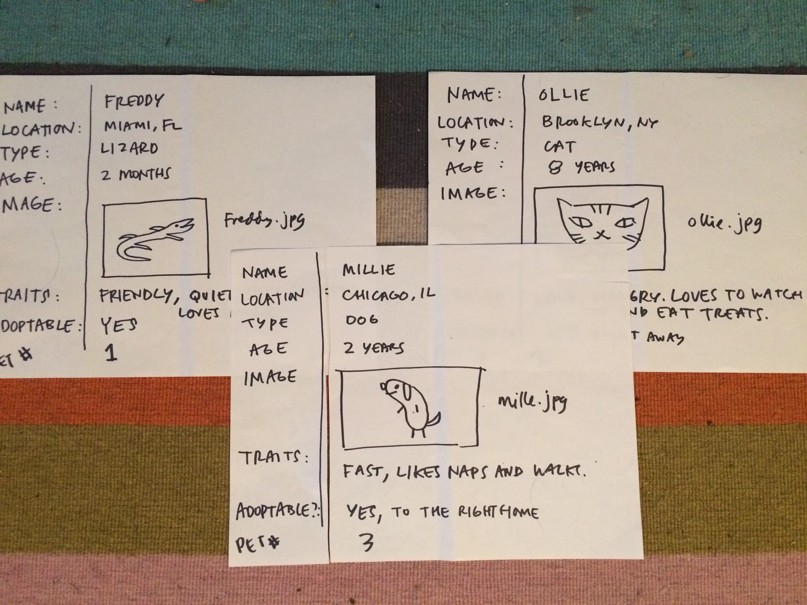
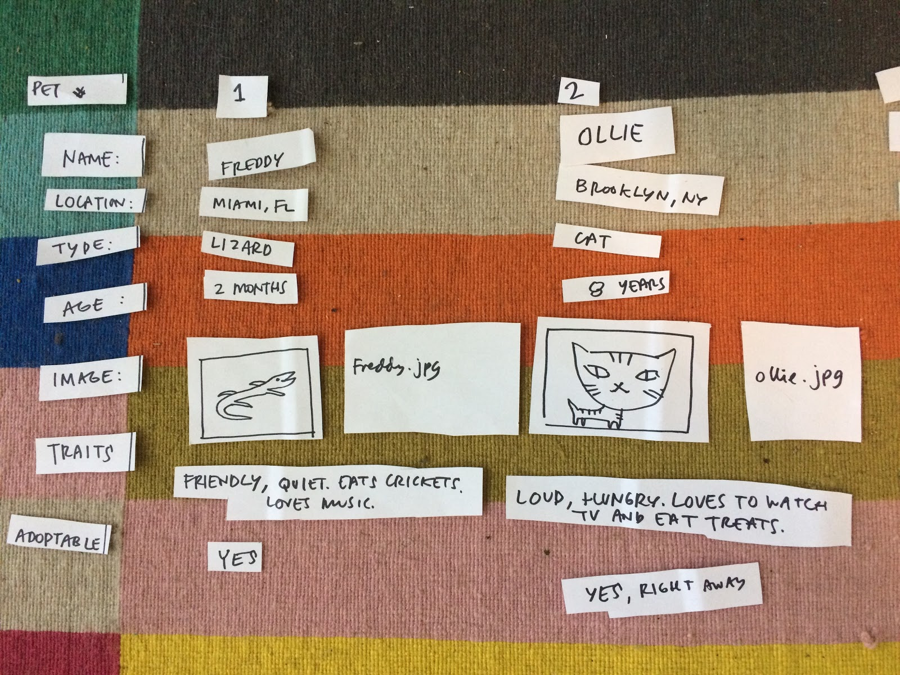
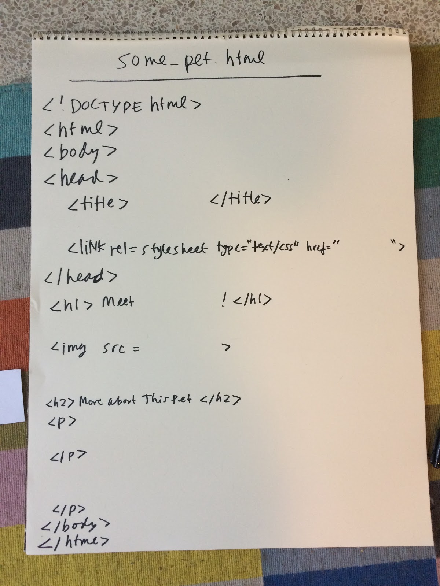
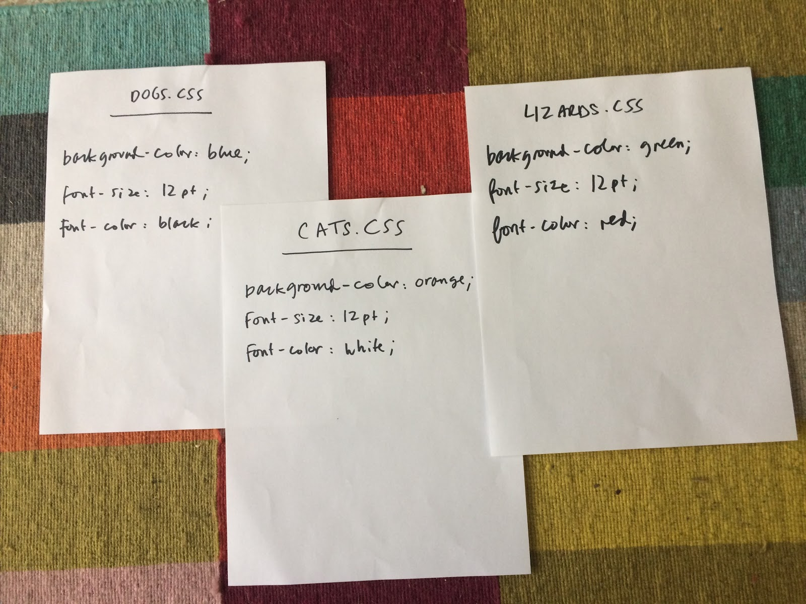
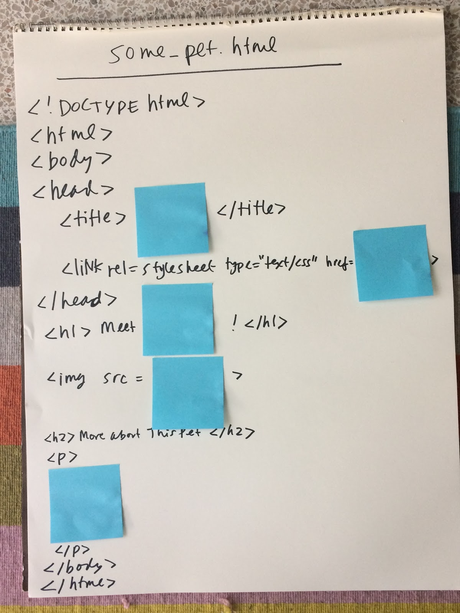
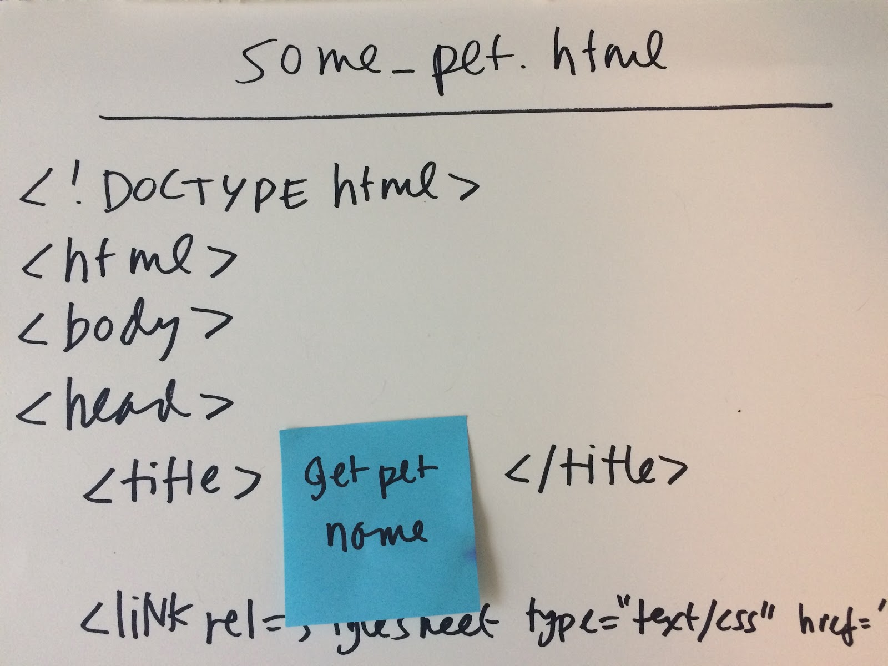
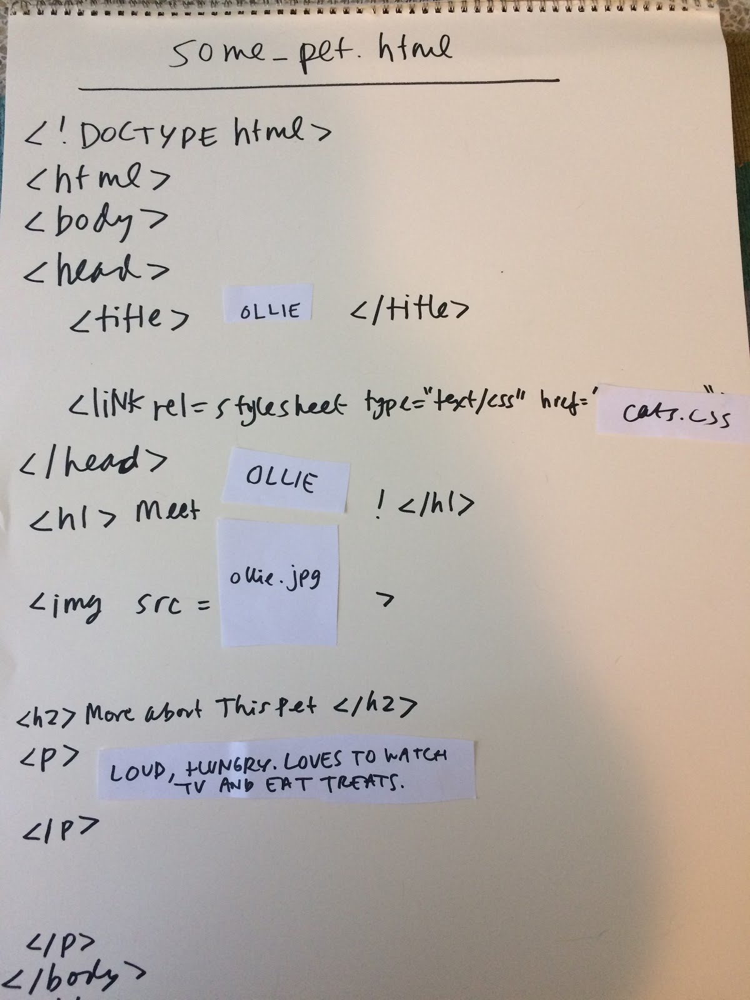

#### Description
In this activity, we introduce learners to systems-- called website builders or content management systems-- that many people (designers, developers, as well as web newcomers who are non-experts) use to create websites with lots of different pages and frequently updated content, such as blogs or shopping sites. Learners do some data collection, and use analog (pen and paper) examples to explore how web builders work.  

#### Learning Objectives
* Define a website builder/content management systems.
* Identify four basic elements of website building tools.
* Describe how the elements of website builders work to create web pages.

#### Time Required
45 minutes to 1 hour depending on group size

#### Audience
Can be tailored for audiences from 13 up; with varying levels of experience with the web.

#### Materials
* Pencil and paper
* Print worksheet with the following information:
    * Worksheet 1: Pet Listing
    * Pet Name:
    * Location:
    * Type (cat, dog, etc):
    * Age:
    * Image:
    * Traits:
    * Available to Adopt (yes/no):

#### Web Literacy Skills
* Code
* Compose
* Design

#### 21st Century Skills
* Communication
* Collaboration
* Creativity

#### Earning Digital Badges
Digital badges capture the evidence and are the demonstration knowledge and achievement. Each Core Activity encompasses multiple web literacy skills. Completion of all Core Activities will enable anyone to earn all web literacy plus 21C skills badges. Thus, we encourage you to complete all the Core Activities, and earn badges to capture what you've learned. Digitalme is offering web literacy badges through the [Open Badges Academy](https://www.openbadgeacademy.com/mozilladirectory). 

### Introduction 
[2 mins]
* Explain:
* Today we’re going to talk about some software tools-- called website builders or content management systems-- that many people (designers, developers, as well as web newcomers who are non-experts) use to create websites.
* These tools pull together HTML and CSS (Cascading Style Sheets, used to add visual styles to web sites) along with other programming languages to speed the process of website creation. 
* But first, let’s do a quick, fun data collection activity-- we’ll use this data to model how web builders work. 

### Activity: Data Collection 
[5 mins]
* Facilitator hands out mini-worksheets (print 2 per page/cut to save paper). Ask learners to fill them out. Explain: 
* It’s OK to make up the information.
* On the pet worksheet, you can draw a super simple picture-- stick figures are totally fine! 
* Worksheet text is below. Facilitator can remix as needed.
* Collect worksheets and let learners know we’ll come back to them.

Worksheet 1: Pet Listing
Pet Name:
Location:
Type (cat, dog, etc):
Age:
Image:
Traits:
Available to Adopt (yes/no):

### Discussion: Website Creation 
[30 mins]
* Explain: We’ve seen how to build a basic web page—we take content and mark it up in HTML. This works great, especially for sites that won’t change too much or for small sites with just 5 or 6 pages. Ask learners:     
    * Can you think of some static sites— sites that don’t have new content often, or ever? Or sites with very few pages? Examples might be a small restaurant, etc. 
* But what if we have information that changes all the time? Or if we have lots and lots of information? What are sites that change a lot? * Examples might be: Weather and news sites, blogs, social media sites like Facebook, instagram, shopping sites. 
* What kinds of sites or pages do we visit most often? What does this say about the internet? (i.e. lots of change, lots of new information) 
* Let’s imagine we’re making a site with lots of pages-- a site that lists different pets, where people can browse the listings see if they want to adopt a pet.
* Ask learners: What pages do we need on our site? (home page, maybe an about page, and maybe a page that talks about each pet) 
* So let’s figure out the steps for doing our web site creation process, and write the steps or, in other words, an algorithm for it. Let’s say we have our “home” and “about” pages already. And we’ll use the pet data we just collected. What’s the algorithm we’d write for this process?
> Tip! Sample algorithm for creating pet pages is here:
> * Open text editor, save new document as .HTML
> * Type or paste in content for first pet page
>    * Pet Name:
>    * Location:
>    * Image:
>    * Age:
>    * Traits:
>    * Available to Adopt (yes/no):
>    * Comment:
> * Mark it up with HTML
>    * Add styles for each type of data using CSS
>    * Save, and check to see that it works in browser
>    * Open text editor, save new document as .HTML
> * Paste in content for next pet page
>    * Pet Name:
>    * Location:
>    * Image:
>    * Age:
>    * Traits:
>    * Available to Adopt (yes/no):
>    * Comment:
> * Mark it up with HTML
> * Add styles using CSS
> * Save, and check to see that it works in browser
> * (Repeat x times)

* Ask learners: 
    * How does this algorithm look? What do you notice about it? 
    * How are you going to feel about adding all the pets? Possible responses: it’s repetitive, we’re doing the same thing over and over, tedious to get through all the pets, it’s going to take forever.
    * What could we do to improve this process?
* Explain that this is the challenge for any site-- like a blog or a shopping site, a new site-- it will take forever to make all those changes and new pages! 
* Explain that developers and designers have created tools-- some of which are free and focused on first-time users, like you-- that help streamline these processes, so no one has to mark up tens or hundreds or even thousands of similar pages. 
* In a web builder, the computer does the hard part! Anytime we have a repetitive process, it’s GREAT work for a software program-- computers do tasks like this much better than humans, with no complaining.
* These web builder tools, in their most basic form, combine four elements. We’ll talk about how they work together. 
    * Content stored in a database
    * HTML templates 
    * CSS design rules 
* Some code that runs on the to bring all these together, on the fly (PHP, Python, Ruby, Javascript)
* A user simple interface for entering content. 
    * This interface hides the html, css, and any code from the user. They are sometimes drag-and-drop, or you type in your content and make some simple selections. But we’re going to explore how the web builders work behind the scenes, once all your stuff is entered in the database.
* Let’s see how this is done, for our pet site, on paper. First we need our 4 ingredients!
    * Content in the database
* We’ll cut our sheets up, because we’re going to want to access pieces of data separately.

* Create an HTML template for the pet page. We’ll leave some blanks where the content will go.
* See example:

* Create some very style rules (different for cats, dogs, lizards).
* Background color of the page
* Font size and color

* Drop some code instructions into the HTML template to tell the computer how to put it all together. We’ll write these where the blue sticky notes are, where we want our data to go. It’s a bit like fill-in-the blank, or mad libs! 

* If we were developers working on this web site on a computer, we’d do write this in programming language, but here we’ll just write basic instructions, called “pseudo-code.” It’s not the actual wording we’d need for an actual programming language,  but it expresses the intent of the instructions.
* What are the instructions? Let’s write another algorithm. This can be whatever we want in terms of what content to add where, but here’s an example:
    * Access the desired pet record
    * Put the Pet Name or Pet Number in the title
    * Assign the correct style sheet
    * Put the pet name in the heading
    * Put the image name in the img tag
    * Put the traits in the final paragraph
* Write the instructions you came up with on the sticky notes

* Now, be the code! 
* Have a learner try assembling the page by following the sticky note instructions-- this is what the code does! 

* When a client’s browser requests this page for a particular pet (say, Pet #2) the server-side code will pull together the info from the database, assign the correct stylesheet, and send it all along to your browser. It makes the page on the fly! So a page for each pet doesn’t exist in a static way, but is made on-demand. 

* This is what happens behind the scenes in any of the content management systems/ web builder platforms, like Wordpress or SquareSpace or Wix. 
* As a user, you’d mostly be typing content into an interface, and selecting a template, and pressing a “publish” button. The code on the server side and in the browser does the rest! And now YOU know how that works!

### Learning Experience Reflection 
[5 mins]
* What did you like about this activity?
* If you might teach this activity to a particular audience, what might you change about the process, structure, or content to better meet the needs of that audience? 

### Feedback on Core Curriculum
* Tell us [how and where you're using the curriculum](https://github.com/mozilla/web-lit-core/issues/8) and [what you've learned and what might you change](https://github.com/mozilla/web-lit-core/issues/9).

